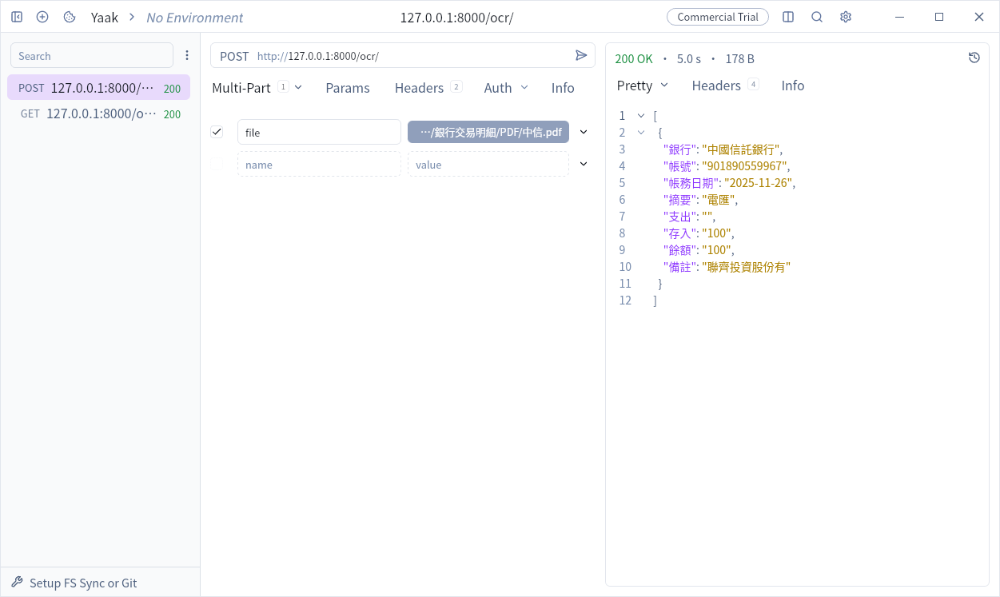

# Gemini-OCR-FastAPI

## 專案簡介
本專案利用 Gemini 多模態模型，自動解析各種格式的交易明細圖像，並將其轉換為標準化的 JSON 格式，旨在提供高效且精準的 OCR 解決方案。

## 關鍵功能
  + 多格式支援： 支援解析多種交易明細表格式。
  + 結構化輸出： 強制輸出一致的 JSON schema。
  + FastAPI 驅動： 提供高性能、非同步的 REST API 接口。

## 快速開始
### 1. 環境需求
  + Python 3.10+
  + Google API Key (取得 [Gemini API Key](https://aistudio.google.com/api-keys))

### 2. 安裝與執行
安裝與環境變數：
  + 安裝依賴套件：
    ```Bash
    pip install -r requirements.txt
    ```
  + 設定環境變數：
    ```Bash
    export GOOGLE_API_KEY="你的金鑰"
    ```

選擇以下任一方法啟動 API 服務：
  + 標準啟動：
    ```Bash
    python server.py
    ```
  + 開發模式 (自動重載)：
    ```Bash
    uvicorn server:app --reload
    ```
## Docker 部署
使用容器化技術快速部署環境：
  1. 構建映像檔：
     ```Bash
     docker build -t gemini-ocr-fastapi .
     ```

  2. 啟動容器：
     ```Bash
     docker run --rm -it -e "GOOGLE_API_KEY=你的金鑰" -p 8000:8000 --name gemini-ocr gemini-ocr-fastapi
     ```
## API 使用說明
使用 curl 指令進行測試
```Bash
curl -X POST 'http://127.0.0.1:8000/ocr/' \
  --header 'Content-Type: multipart/form-data' \
  --header 'Accept: application/json' \
  --form file=@/path/to/your.pdf
```

使用軟體 [Yaak](https://yaak.app/) 進行測試
